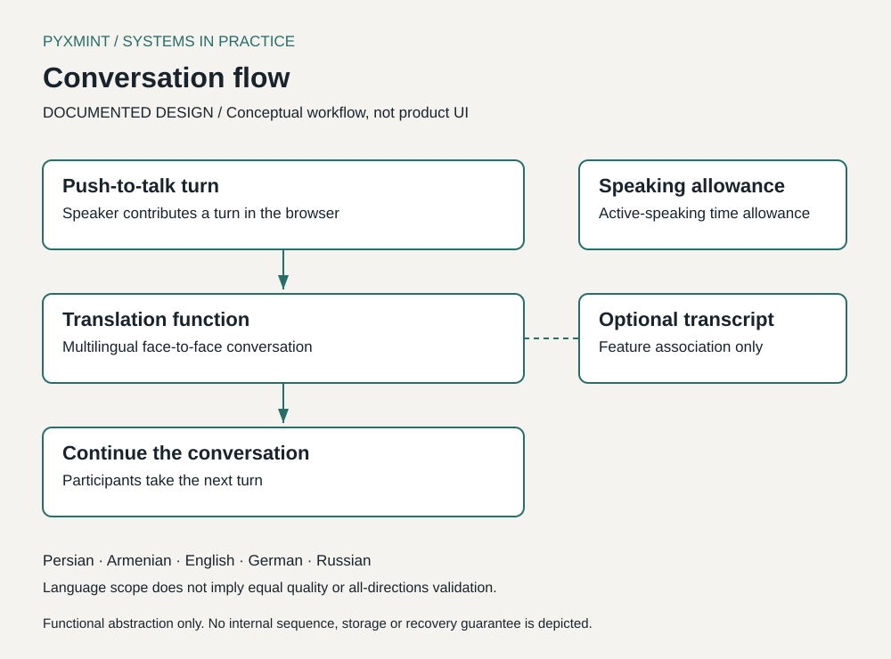

# PyxMint Translator

## A conversation workflow for face-to-face multilingual communication

**Working, field-tested MVP · Documentation-only case study**

By Farshid Ghaffari — AI-Leveraged Workflow & Business Systems Specialist.

This documentation-only case study presents the problem, conversation workflow, product decisions and field observations as portfolio/reference material.

## Problem

Face-to-face conversation across languages needs more than an isolated translated sentence: people need a workable way to take turns and keep a conversation moving. PyxMint explores that workflow in a browser.

## AI-assisted implementation and role

Farshid identified the product problem, designed the conversation workflow, made product/system decisions, used AI-assisted implementation, tested real-world behavior, reviewed failures and iterated the product.

The evidence is problem-solving, workflow decisions and validation of a usable MVP. No claim is made that Farshid independently hand-coded every component.

## Available evidence

Available evidence: a documented conversation workflow, conceptual diagrams, qualitative café field observations and a proposed test matrix. Application source, real transcripts and private operational data are excluded.

## Existing friction / bottleneck

The design problem is the effort of coordinating speaking, translation and the next turn. Field testing also exposed noisy-input difficulties, sentence-start issues in some Armenian → Persian attempts and more noticeable latency on longer turns. These are qualitative observations, not measured productivity or accuracy results.

## Workflow design — DOCUMENTED DESIGN

PyxMint uses a browser-based, push-to-talk conversation workflow, with an optional transcript and an active-speaking time allowance. The MVP includes Persian, Armenian, English, German and Russian. Listing languages does not imply equal quality, or validation of every direction between them.

The diagram abstracts interaction responsibilities. It is not a screen capture, an implementation sequence trace or a guarantee about failure recovery. See [system design](docs/system-design.md) and [key decisions](docs/key-decisions.md).

## System design — DOCUMENTED DESIGN

The documented scope is the user-facing conversation workflow: push-to-talk, multilingual translation, an optional transcript and an active-speaking time allowance. This case study deliberately stops at functional boundaries. It does not assert provider choices, service topology, storage behavior or deployment details.

## Testing and iteration — OBSERVED

Café field testing took place in Gyumri. Approved qualitative observations include noisy-input difficulties, Armenian → Persian sentence-start issues in some attempts, better performance with synthetic Armenian input than in some live/noisy attempts, and more noticeable latency with longer turns.

These observations do not establish cause, quantify latency, measure accuracy or prove that one condition alone explains a difference. See [field testing](docs/field-testing.md).

## Current MVP status

Working, field-tested MVP. This is not a claim of production maturity, commercial traction or comprehensive language validation. The evidence here is an owner-approved account; no raw recordings, real transcripts or private analytics are included. See the [evidence register](docs/evidence-register.md).

## Known limits

The observations are qualitative. Sample counts, controlled comparisons, accuracy benchmarks, deployment/security guarantees and automated test coverage are not established by this case study. The implementation and operational details remain outside its scope.

## Intended business value

The workflow is designed to reduce friction in face-to-face multilingual exchanges and the effort of managing repeated conversation turns. These are design aims, not verified time savings, ROI, cost savings or error reduction.

## PROPOSED NEXT TESTS

A future matrix would vary language direction, live versus synthetic input, quiet versus noisy conditions and turn length. It would record sentence-start behavior, conversation continuity and consistently defined timing. It has not been executed as part of this documentation work. See [limitations and next steps](docs/limitations-and-next-steps.md).

## Documentation

- [Problem and constraints](docs/problem-and-constraints.md)
- [System design](docs/system-design.md)
- [Key decisions](docs/key-decisions.md)
- [Field testing](docs/field-testing.md)
- [Limitations and next steps](docs/limitations-and-next-steps.md)
- [Evidence register](docs/evidence-register.md)
- [Privacy and public scope](docs/privacy-and-public-scope.md)
- [Screenshot policy](assets/screenshots/README.md)

There is no runnable application or setup procedure in this repository. The SVGs are functional editorial diagrams, not product screenshots or field-test photographs.

## More work

This case study is one example of my work in workflow design, practical business systems and testing under real conditions.

[Portfolio — Farshid Ghaffari](https://farshidghaffari.net)

## Portfolio use

© 2026 Farshid Ghaffari.
Documentation and diagrams are presented as portfolio/reference material.
Reuse or redistribution requires permission.

This is not an open-source license.
