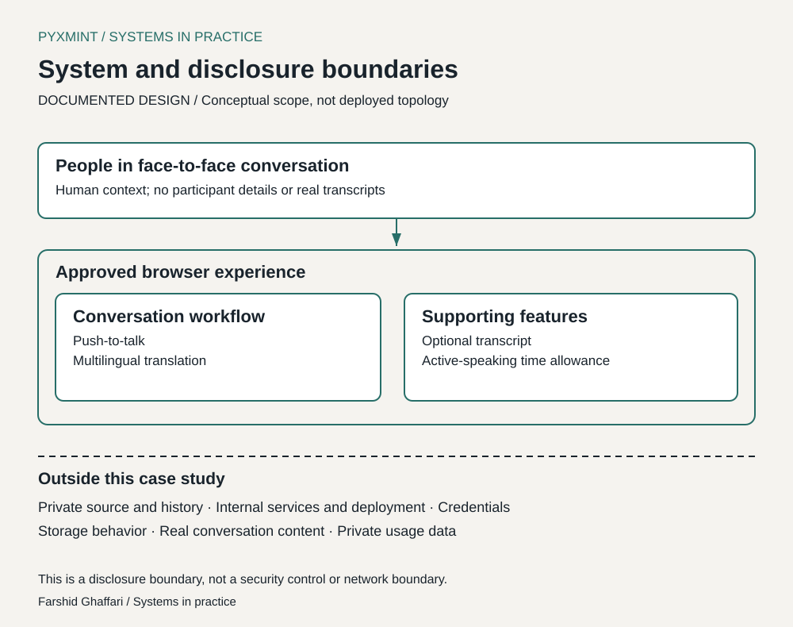

# System design

## DOCUMENTED DESIGN — functional scope

This is a conceptual view of approved user-facing behavior, not a reverse-engineered architecture or private implementation description.

| Functional concern | Approved scope | Boundary of the claim |
| --- | --- | --- |
| Conversation surface | Browser-based face-to-face multilingual conversation | No browser/device compatibility matrix is claimed |
| Turn input | Push-to-talk | No automatic turn detection or interruption behavior is claimed |
| Languages | Persian, Armenian, English, German and Russian | No equal-quality or all-directions validation claim |
| Transcript | Optional | No retention, persistence, deletion or export guarantee |
| Speaking allowance | Active-speaking time allowance | No amount, pricing or accounting algorithm disclosed |

The flow presents turn input, a translation function and continuation of the conversation. The optional transcript is shown as a functional association, not a claim about event ordering or storage. The allowance is a product constraint; its enforcement mechanism is not depicted.

The second diagram separates approved experience-level documentation from excluded implementation detail. It is a disclosure boundary, not a network diagram or security control.

## Design scope versus implementation detail

No provider/model names, API routes, credentials, service identifiers, deployment topology, source fragments or private repository links are needed to explain the workflow. No language/framework, database, queue or speech-processing pipeline is asserted without separately approved evidence.

## OBSERVED constraints and PROPOSED NEXT TESTS

Noisy input, some sentence starts and longer turns need further evaluation. The [future test matrix](limitations-and-next-steps.md) specifies proposed investigation areas. It does not claim existing retry logic, recovery guarantees or diagnosis of any underlying component.
